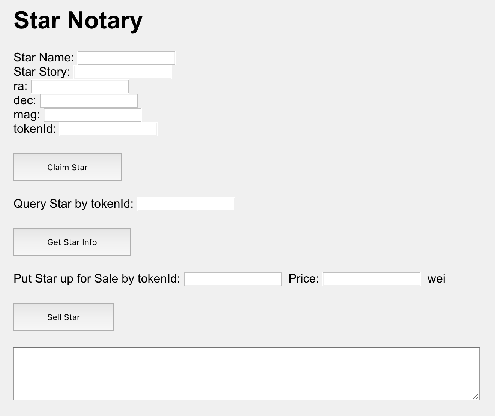

Decentralized Star Notary
--

### Test
```shell
cd smart_contracts && npm install && truffle test
```

### Client
I used VS Code plugin

### Contract Address
`0xBb83e6A664a17f61D3c3a732eBF2Ff2B93A83eF7`

### Contract Creation Transaction Hash
`0xb6d95b2d30480a0099bd8466e5a977f99feee994f1644f390f01260ec892172b`

### Claim Star Transaction Hash
`0x061ec747890ffa2ef30b7e86c95684e0d19faf2d5d786b5efb8a89dda25e2f58`

### Claim Star tokenId
1

### Sell Star Transaction Hash
`0xd4417285bd2b4a048480df070e0b30802ba550a2343402874124dc15a47775ac`

### Screenshot

